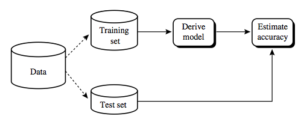
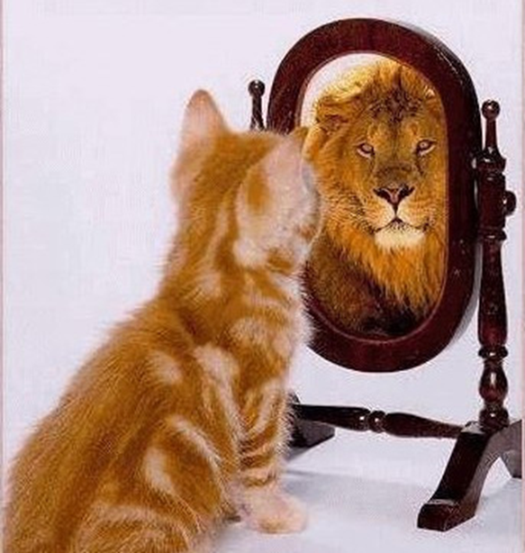
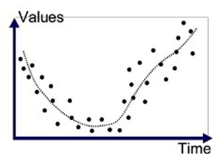
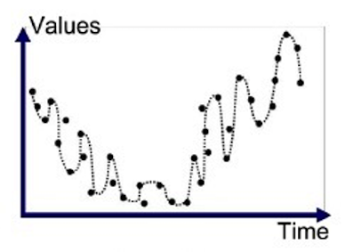

Nowadays, machine learning is one of the most leading topics in the world, which creates a dramatic demand for data mining and statistical analysis. Machine learning is a computer program that is able to learn and improve its behaviour from past experience without being explicitly programmed by human beings. It is widely used to construct a learning model to study from the past data in order to make a prediction on new-coming data.

Most data science beginners, like us, are likely to unconsciously encounter an obstacle that can ruin all their effort when they build machine learning models.

The obstacle is __overfitting__.

Do not be panic! In this blog, we will walk through over what overfitting is.

Before we go on and explore what the overfitting is, let us start with the general procedures to build a machine learning model. We usually separate a data source into two parts, a large portion and a small portion. The large portion of the original data is called a __training dataset__ that is used to train a machine learning model. The other part is called a __test dataset__ to test the accuracy of the model.

*Figure 1. An example of separation of training dataset and test dataset [source](http://www.nosimpler.me/machine-learning/)*

Overfitting occurs a lot, especially in supervised machine learning. __Supervised learning__ is the algorithm that aims to find a general relationship between input variables X and an output variable Y for mapping input values to output targets. This relationship can be written as a function as follows:

$$Y = f(X)$$

For example, given a dataset about the size of houses, the location and etc. on the real estate in Great Vancouver, we can predict the price for a given house. How do we do? We firstly divide a dataset into training and test groups. We then define what variables (X) corresponding to what house prices (Y). Based on the information, a machine learning model is trained to learn how to compute the price of a house for given input variables. This is the basic idea of how machine learning works on prediction.

We are ready to move on. So what is overfitting?

### Analogy of overfitting

Let's take a look at a close analogy with overfitting, namely, __overconfidence__.  When people are overconfident, they produce a biased way of seeing oneself and thinks they are better than their own judgment and characteristics in their comfort zone. This usually leads to failure when they move to different areas. An overfitting machine learning model is like a conceited person who tends to underestimate the probability of making mistakes. Then it provides a good result for some datasets but poor performance on new datasets.

Hence can say that the model is incapable of generalizing from training data sets to some unseen datasets because the data we collect is limited and incomplete.

*Figure 2. The way you look at yourself when you are overconfident [Source](https://www.newsbucovina.ro/politica/179990/liderul-om-psd-suceavadan-ioan-cusnir-raspuns-neconventional-la-scrisoarea-deschisa-liderului-sucevean-al-usr/attachment/pisica-care-se-vede-leu)*

### A further explanation

What exactly happens when a machine learning algorithm is overfitting? Let's take a closer look at the following graph (__Figure 3.__) in which a group of data points scatters out. If you are asked to draw a line to represent the trend of the graph, how are you going to fit this graph?

The __goodness of fit__ refers to how well the values predicted by a model match the target values. By knowing this, most people are likely to plot the one like the dashed line shown in the graph. The difference between the values we expect and the given output values is fair enough. Here, we can assume the overall difference or the error between the points and the dashed line is about `10`. If we test this model on a new data set, the error won't change too much and it is still good to match output values. This is a __good fit__ for the graph.

*Figure 3. An example of good fit [source](https://algotrading101.com/blog/1543426/what-is-curve-fitting-overfitting-in-trading-optimization)*

We also hope that our machine learning algorithm does the same thing to summarize the trend of this training dataset. However, sometimes, the machine learning model is too entangled with the error and it tries so hard to minimize the error from `10` to `1`. The model it builds may look like the following one (__Figure 4.__). In order to maximize the accuracy of the dataset, it almost passes through every single point include some garbage data or irrelevant data. The outcome accuracy from this training dataset is very high. When we apply this model in practice and test on a new dataset, it shows a low accuracy and poor performance. This is because it relies on the training dataset too much but it is not generalized to fit with a new data set. This is called __overfitting__.

*Figure 4. An example of good fit [source](https://algotrading101.com/blog/1543426/what-is-curve-fitting-overfitting-in-trading-optimization)*

### Summary

In this blog, we have studies quite a few concepts, including:
  - a basic idea of supervised machine learning
  - training dataset and test dataset
  - what overfitting is
  - the poor performance of an overfitting model

Overfitting leads to the poor performance of a trained machine learning model on unseen datasets.

Now you may wonder how to prevent overfitting.

There are some techniques that we can use to limit overfitting phenomena, such as training with more data, cross Validation and L1&L2 regularization. Hopefully seeing this blog interests you and make you to further explore the methods to limit overfitting.

### Reference
[1] Anup Bhande. *"What is underfitting and overfitting in machine learning and how to deal with it."* [link](https://medium.com/greyatom/what-is-underfitting-and-overfitting-in-machine-learning-and-how-to-deal-with-it-6803a989c76)

[2] Jason Brownlee. *"Overfitting and Underfitting With Machine Learning Algorithms"* [link](https://machinelearningmastery.com/overfitting-and-underfitting-with-machine-learning-algorithms/)

[3] William Koehrsen. *"Overfitting vs. Underfitting: A Conceptual Explanation"* [link](https://towardsdatascience.com/overfitting-vs-underfitting-a-conceptual-explanation-d94ee20ca7f9)

[4] shobha Mourya. *"Machine Learning"* [Link](http://www.nosimpler.me/machine-learning/)
